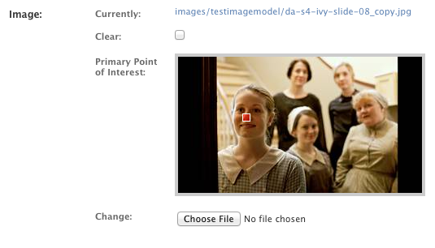

# django-versatileimagefield #

## About ##

A drop-in replacement for django's ImageField that provides a flexible, intuitive and easily-extensible interface for quickly creating renditions of the images assigned to it.

### Current Version ###

0.1

## Installation ##

Installation is easy with [pip](https://pypi.python.org/pypi/pip):

```bash
$ pip install django-versatileimagefield
```

### Dependencies ###

* `Pillow` >= 2.4.0

`django-versatileimagefield` depends on the excellent [`Pillow`](http://pillow.readthedocs.org) library. If you already have PIL installed, it is recommended you uninstall PIL prior to installing `django-versatileimagefield`:

```bash
$ pip uninstall PIL
$ pip install django-versatileimagefield
```

### Settings ###

After installation completes, add `'versatileimagefield'` to `INSTALLED_APPS`:

```python
INSTALLED_APPS += ('versatileimagefield',)
```

You can fine-tune how `django-versatileimagefield` works via the `VERSATILEIMAGEFIELD_SETTINGS` setting:

```python
VERSATILEIMAGEFIELD_SETTINGS = {
     # The amount of time, in seconds, that references to created images
     # should be stored in the cache. Defaults to `2592000` (30 days)
    'cache_length': 2592000,
    # The name of the cache you'd like `django-versatileimagefield` to use.
    # Defaults to 'versatileimagefield_cache'. If no cache exists with the name
    # provided, the 'default' cache will be used instead.
    'cache_name': 'versatileimagefield_cache',
    # The save quality of modified JPEG images. More info here:
    # http://pillow.readthedocs.org/en/latest/handbook/image-file-formats.html#jpeg
    # Defaults to 70
    'jpeg_resize_quality': 70,
    # A path on disc to an image that will be used as a 'placeholder'
    # for non-existant images.
    # If 'global_placeholder_image' is unset, the excellent, free-to-use
    # http://placehold.it service will be used instead.
    'global_placeholder_image': '/path/to/an-image.png',
    # The name of the top-level folder within storage classes to save all
    # sized images. Defaults to '__sized__'
    'sized_directory_name': '__sized__',
    # The name of the directory to save all filtered images within.
    # Defaults to '__filtered__':
    'filtered_directory_name': '__filtered__'
}
```

## Overview ##

The centerpiece of `django-versatileimagefield` is its `VersatileImageField` which provides a simple, flexible interface for creating new images from the image you assign to it.

### Model Example ###

`VersatileImageField` extends django's `ImageField` and can be used as a drop-in replacement for it. Here's a simple example model that depicts a typical usage of django's `ImageField`:

```python
# models.py with `ImageField`
from django.db import models

class ImageExampleModel(models.Model):
    name = models.CharField(
        'Name',
        max_length=80
    )
    image = models.ImageField(
        'Image',
        upload_to='images/testimagemodel/',
        width_field='width',
        height_field='height'
    )
    height = models.PositiveIntegerField(
        'Image Height',
        blank=True,
        null=True
    )
    width = models.PositiveIntegerField(
        'Image Width',
        blank=True,
        null=True
    )

    class Meta:
        verbose_name = 'Image Example'
        verbose_name_plural = 'Image Examples'
```

And here's that same model using `VersatileImageField` instead:

```python
# models.py with `VersatileImageField`
from django.db import models

from versatileimagefield.fields import VersatileImageField

class ImageExampleModel(models.Model):
    name = models.CharField(
        'Name',
        max_length=80
    )
    image = VersatileImageField(
        'Image',
        upload_to='images/testimagemodel/',
        width_field='width',
        height_field='height'
    )
    height = models.PositiveIntegerField(
        'Image Height',
        blank=True,
        null=True
    )
    width = models.PositiveIntegerField(
        'Image Width',
        blank=True,
        null=True
    )

    class Meta:
        verbose_name = 'Image Example'
        verbose_name_plural = 'Image Examples'
```

> ### NOTE ###
> `VersatileImageField` is fully interchangable with [`django.db.models.ImageField`](https://docs.djangoproject.com/en/dev/ref/models/fields/#imagefield) which means you can revert back to using django's `ImageField` anytime you'd like. It's fully-compatible with [`south`](http://south.readthedocs.org/en/latest/index.html) so migrate to your heart's content!

## Sizers & Filters ##

Where `VersatileImageField` shines is in its ability to create new images on the fly via its Sizer & Filter framework.

### Sizers ###

The Sizer framework gives you a way to create new images of differing sizes from the one assigned to the field. `VersatileImageField` ships with two Sizers, `thumbnail` and `crop`.

#### thumbnail ####

Here's how you would create a thumbnail image that would fit within a 400px by 400px bounding box with `VersatileImageField`:

```python
# Importing our example Model
>>> from someapp.models import ImageExampleModel
# Retrieving a model instance
>>> example = ImageExampleModel.objects.all()[0]
# Displaying the path-on-storage of the image currently assigned to the field
>>> example.image.name
u'images/testimagemodel/test-image.jpg'
# Retrieving the path on the field's storage class to a 400px wide by 400px tall
# constrained thumbnail of the image
>>> example.image.thumbnail['400x400'].name
u'__sized__/images/testimagemodel/test-image-thumbnail-400x400.jpg'
# Retrieving the URL to the 400px wide by 400px tall thumbnail
>>> example.image.thumbnail['400x400'].url
u'/media/__sized__/images/testimagemodel/test-image-thumbnail-400x400.jpg'
```

If you want to open the created thumbnail image as an image file directly in the shell:

```python
>>> thumbnail_image = example.image.field.storage.open(example.image.thumbnail['400x400'].name)
```

#### crop ####

If you wanted create an image cropped to a specific size, use the `crop` Sizer:

```python
# Retrieving the URL to a 400px wide by 400px tall crop of the image
>>> example.image.crop['400x400'].url
u'/media/__sized__/images/testimagemodel/test-image-crop-c0-5__0-5-400x400.jpg'
```

> ### NOTE ###
> The `crop` Sizer will first scale an image down to its longest side (via the same mechanism used by the `thumbnail` Sizer) and then crop/trim inwards, centered on the **Primary Point of Interest** (PPOI, for short). For more info about what PPOI is and how it's used see the _Specifying a Primary Point of Interest (PPOI)_ heading below.

Each Sizer registered to the Sizer registry is a `dict` subclass and available as an attribute on each `VersatileImageField` which accepts keys comprised of two integers – representing width and height, respectively – separated by an 'x'. If you send a malformed/invalid key to a Sizer, a `MalformedSizedImageKey` exception will raise.

#### How Sized Image Files are Named/Stored ####

All Sizers subclass from `versatileimagefield.datastructures.sizedimage.SizedImage` which returns a unique-to-size-specified string – via its `get_filename_key()` method – that is included in the filename of each image it creates.

> ##### NOTE #####
> The `thumbnail` Sizer simply combines `'thumbnail'` with the size key passed (i.e. `'400x400'` ) while the `crop` Sizer combines `'crop'`, the field's PPOI value (as a string) and the size key passed; all Sizer 'filename keys' begin and end with dashes `'-'` for readability.

All images created by a Sizer are stored within the field's `storage` class in a top-level folder named `'__sized__'`, maintaining the same descendant folder structure as the original image. If you'd like to change the name of this folder to something other than `'__sized__'`, adjust the value of `VERSATILEIMAGEFIELD_SETTINGS['sized_directory_name']` within your settings file.

Sizers are quick and easy to write, for more information about creating your own, see the 'Writing Custom Sizers' section below.

### Filters ###

Filters are similar to Sizers in that they create new images but they differ in a few key ways. An example by way of our `TestImageModel` model:

```python
# Importing our example Model
>>> from someapp.models import ImageExampleModel
# Retrieving a model instance
>>> example = ImageExampleModel.objects.all()[0]
# Returning the path-on-storage to the image currently assigned to the field
>>> example.image.name
u'images/testimagemodel/test-image.jpg'
# Displaying the path (within the field's storage class) to an image
# with an inverted color pallete from that of the original image
>>> example.image.filters.invert.name
u'images/testimagemodel/__filtered__/test-image__invert__.jpg'
# Displaying the URL to the inverted image
>>> example.image.filters.invert.url
u'/media/images/testimagemodel/__filtered__/test-image__invert__.jpg'
```

As you can see, there's a `filters` attribute available on each `VersatileImageField` which contains all filters currently registered to the Filter registry.

> #### NOTE ####
> `django-versatileimagefield` ships with a single Filter – `invert` – which inverts the colors of an image.

What makes Filters extra-useful is that they have access to all registered Sizers:

```python
# Creating a thumbnail of a filtered image
>>> example.image.filters.invert.thumbnail['400x400'].url
u'/media/images/testimagemodel/__filtered__/test-image__invert__-thumbnail-400x400.jpg'
# Creating a crop from a filtered image
>>> example.image.filters.invert.crop['400x400'].url
u'/media/images/testimagemodel/__filtered__/test-image__invert__-c0-5__0-5-400x400.jpg'
```

> #### When Filtered Images Are Created ####
> Filtered images are created the first time they are directly accessed (by either accessing their `name`/`url` attributes or by directly accessing a Sizer attached to it). Once created, a reference is stored in the cache for each created image which makes for speedy subsequent retrievals.

#### How Filtered Image Files are Named/Stored ####

All Filters subclass from `versatileimagefield.datastructures.filteredimage.FilteredImage` which provides a `get_filename_key()` method that returns a unique-to-filter-specified string which is then surrounded by double underscores and appended to the filename of each image it creates.

All images created by a Filter are stored within a folder named `__filtered__` that sits in the same directory as the original image. If you'd like to change the name of this folder to something other than '__filtered__', adjust the value of `VERSATILEIMAGEFIELD_SETTINGS['filtered_directory_name']` within your settings file.

Filters are quick and easy to write, for more information about creating your own, see the 'Writing Custom Filters' section below.

## Accessing Sizers / Filters in Templates ##

Template usage is straight forward and easy since both attributes and dictionary keys can be accessed via dot-notation; no crufty templatetags necessary:

```html
<!-- Sizers -->


<!-- Filters -->


<!-- Filters + Sizers -->


```

> ### NOTE ###
> Using the `url` attribute on Sizers is optional in templates. Why? All Sizers return an instance of `versatileimagefield.datastructures.sizedimage.SizedImageInstance` which provides the sized image's URL via the `__unicode__()` method (which django's templating engine looks for when it is asked to render class instances directly).

## Specifying a Primary Point of Interest (PPOI) ##

The `crop` Sizer is super-useful for creating images at a specific size/aspect-ratio however, sometimes you want the 'crop centerpoint' to be somewhere other than the center of a particular image. In fact, the initial inspiration for `django-versatileimagefield` came as a result of tackling this very problem.

PIL's [`ImageOps.fit`](http://pillow.readthedocs.org/en/latest/reference/ImageOps.html#PIL.ImageOps.fit) method (by [Kevin Cazabon](http://www.cazabon.com/)) is what powers the image manipulation of `crop` Sizer and it takes an optional keyword argument, `centering`, which expects a 2-tuple comprised of floats which are less than 0 and greater than 1. These two values together form a cartesian-like coordinate system that dictates where to center the crop (examples: `(0, 0)` will crop to the top left corner, `(0.5, 0.5)` will crop to the center and `(1, 1)` will crop to the bottom right corner).

### The PPOIField ###

Each image managed by a `VersatileImageField` can store its own, unique PPOI in the database via the easy-to-use `PPOIField`. Here's what it looks like in action on our example model:

```python
# models.py with `VersatileImageField` & `PPOIField`
from django.db import models

from versatileimagefield.fields import VersatileImageField, \
    PPOIField

class ImageExampleModel(models.Model):
    name = models.CharField(
        'Name',
        max_length=80
    )
    image = VersatileImageField(
        'Image',
        upload_to='images/testimagemodel/',
        width_field='width',
        height_field='height',
        ppoi_field='ppoi'
    )
    height = models.PositiveIntegerField(
        'Image Height',
        blank=True,
        null=True
    )
    width = models.PositiveIntegerField(
        'Image Width',
        blank=True,
        null=True
    )
    ppoi = PPOIField(
        'Image PPOI'
    )

    class Meta:
        verbose_name = 'Image Example'
        verbose_name_plural = 'Image Examples'
```

As you can see, you'll need to add a new `PPOIField` field to your model and then include the name of that field in the `VersatileImageField`'s `ppoi_field` keyword argument. That's it!

> #### NOTE ####
> `PPOIField` is fully-compatible with [`south`](http://south.readthedocs.org/en/latest/index.html) so migrate to your heart's content!

#### How PPOI is Stored in the Database ####

The **Primary Point of Interest** is stored in the database as a string with the x and y coordinates limited to two decimal places and separated by an 'x' (for instance: `'0.5x0.5'` or `0.62x0.28`).

### Setting your PPOI ###

You should always set an image's PPOI directly on a `VersatileImageField` (as opposed to directly on a `PPOIField` attribute).

> #### NOTE ####
> On save, `VersatileImageField` will ensure its currently-assigned PPOI value is 'sent' to the `PPOIField` associated with it (if any) prior to writing to the database.

#### Via The Shell ####

```python
# Importing our example Model
>>> from someapp.models import ImageExampleModel
# Retrieving a model instance
>>> example = ImageExampleModel.objects.all()[0]
# Retrieving the current PPOI value associated with the image field
# A `VersatileImageField`'s PPOI value is ALWAYS associated with the `ppoi`
# attribute, irregardless of what you named the `PPOIField` attribute on your model
>>> example.image.ppoi
(0.5, 0.5)
# Creating a cropped image
>>> example.image.crop['400x400'].url
u'/media/__sized__/images/testimagemodel/test-image-crop-c0-5__0-5-400x400.jpg'
# Changing the PPOI value
>>> example.image.ppoi = (1, 1)
# Creating a new cropped image with the new PPOI value
>>> example.image.crop['400x400'].url
u'/media/__sized__/images/testimagemodel/test-image-crop-c1__1-400x400.jpg'
# PPOI values can be set as either a tuple or a string
>>> example.image.ppoi = '0.1x0.55'
>>> example.image.ppoi
(0.1, 0.55)
>>> example.image.ppoi = (0.75, 0.25)
>>> example.image.crop['400x400'].url
u'/media/__sized__/images/testimagemodel/test-image-crop-c0-75__0-25-400x400.jpg'
# u'0.75x0.25' is written to the database in the 'ppoi' column associated with
# our example model
>>> example.save()
```

As you can see, changing an image's PPOI changes the filename of the cropped image. This ensures updates to a `VersatileImageField`'s PPOI value will result in unique cache entries for each unique image it creates.

> ##### NOTE #####
> Each time a field's PPOI is set, its Filters & Sizers will be immediately stripped down and re-built to account for this change.

#### Via The Admin ####

It's pretty hard to accurately set a particular image's PPOI when working in the Python shell so `django-versatileimagefield` ships with an admin-ready formfield. Simply add an image, click 'Save and continue editing', and then click where you'd like the PPOI to be. A helpful translucent red square will indicate where the PPOI value is currently set to on the image:



## Writing Custom Sizers & Filters ##

It's quick and easy to create new Sizers & Filters for use on your project's `VersatileImageField` fields or modify already-registered Sizers & Filters.

### Writing a Custom Sizer ###

# TODO
* Placeholder docs
* Add 'Writing Custom Sizers' section to README
* Add 'Writing Custom Filters' section to README
